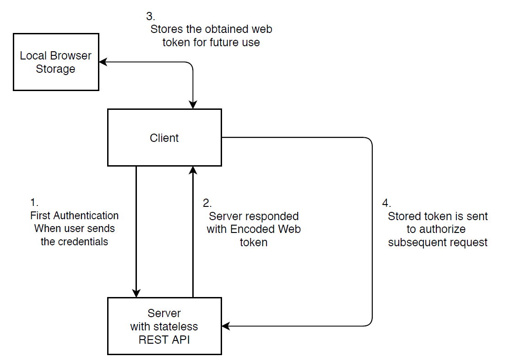
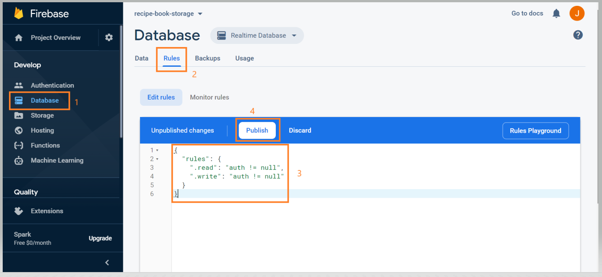
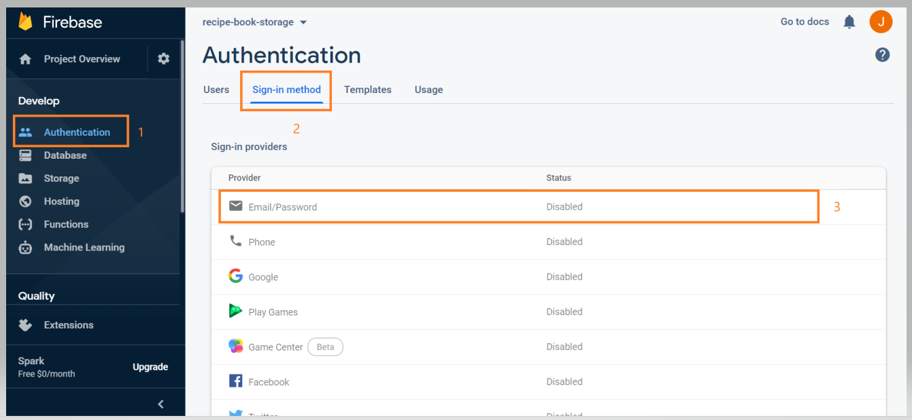
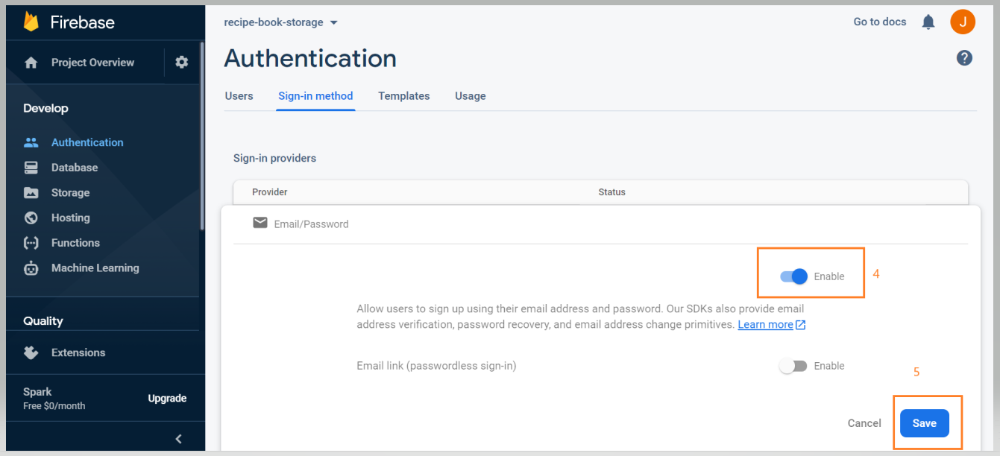
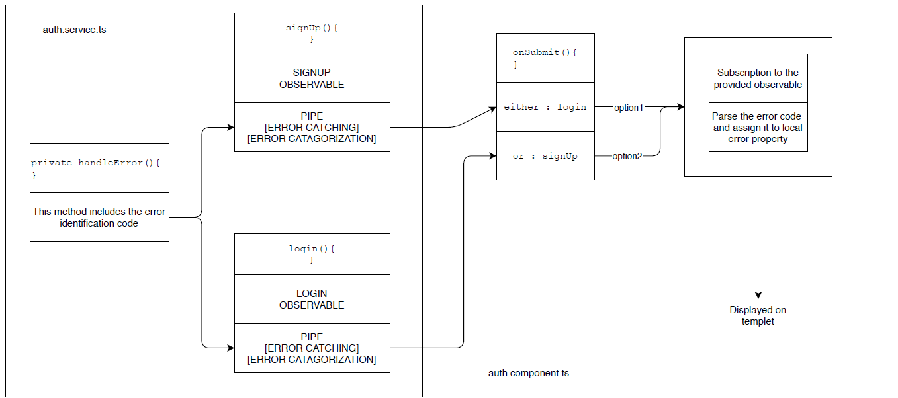

# Authentication

## Goal

1. Create an authentication page with two input fields
2. input 1: Email
3. input 2: Password
4. two buttons [Sign up | Login]

## How authentication works ?

1. In Conventional approach Authentication in **multiple page** web application is performed using session.
2. In Angular based single page application, where communication between client and server happens using REST API
3. And the authentication in Angular app happens over **JSON web token**
4. When Angular client sends authentication request to server, server responses with web token if authentication credentials are valid
5. Web token includes ENCODED string with meta data
6. Web token does not include the encrypted string

## Diagram showing web token based authentication



## Adding Authentication Section into Project

1. Create the component which holds the authentication logic and templet

   ~~~typescript
   app
    |---Auth
          |---- auth.component.ts [logic]
          |---- auth.component.html [templet]
   ~~~

2. Basic skeleton of ```auth.component.ts```

   ~~~typescript
   import { Component } from "@angular/core";
   
   @Component({
       selector: 'app-auth',
       templateUrl: './auth.component.html',
   })
   export class AuthComponent{
   }
   ~~~

3. An authentication templet ```auth.component.html```

   ~~~html
   <div class="row">
       <div class="col-xs-12 col-md-6 col-md-offset">
           <form>
               <div class="form-group">
                   <label for="email">E-mail</label>
                   <input type="text" id="email" class="form-control">
               </div>
   
               <div class="form-group">
                   <label for="password">Password</label>
                   <input type="password" id="password" class="form-control">
               </div>
   
               <div>
                   <button class="btn btn-primary"> Sign up</button> | 
                   <button class="btn btn-primary"> Switch to Login</button>
               </div>
           </form>
       </div>
   </div>
   ~~~

4. Registering the auth component in ```app.module.ts```

   ~~~typescript
   @NgModule({
       declarations: [ AuthComponent ]
   })
   ~~~

5. Setup routing for Authentication page in ```app-routing.module.ts```

   ~~~typescript
   const appRoutes: Routes = [
       {path: 'auth', component: AuthComponent}
       ]
   ~~~

6. App Authentication tab in header ```header.component.html```

   ~~~html
   <div class = "navbar-collapse">
       <ul>
           <li>Recipe</li>
           <li>Shopping list</li>
           
            <li routerLinkActive = "active">
               <a routerLink = "/auth">Authentication</a>
            </li>
       </ul>
   </div>
   ~~~

## Switching between Authentication modes

1. Switch between Login / Sign in mode

2. Adding mode property and method which change the property in ```auth.component.ts```

   ~~~typescript
   export class AuthComponent{
       isLoginMode = true;		// mode property
       onSwitchMode(){			// method which can change the mode property
           this.isLoginMode = !this.isLoginMode;
       }
   }
   ~~~

3. Accessing the above implemented property from templet ```auth.component.html```

   usage of ternary operation to check the mode and choose the button text

   ~~~html
   
   <!--The input fields will remain same for both login and signup-->
   <div>
     <button class="btn btn-primary" 
             type="submit"> 
           {{isLoginMode ? 'Login' : 'Signup'}}
     </button> | 
   
     <button class="btn btn-primary" 
             (click) = "onSwitchMode()" 
             type="button"> 
           Switch to {{isLoginMode ?  'SignUp' : 'Login'}}
     </button>
   </div>
   ~~~

## Handling Form Inputs 

1. Add tags on the input fields

   ~~~html
    <input type="text" 
           name = "email"
           ngModel
           required
           email
    >
   
    <input type="password" 
           name = "password"
           ngModel
           required
           minlength="6"
    >
   
   <!--name and ngModel are tags to register the control in form-->
   <!--required, email and minlength are validators-->
   ~~~

2. Declare local reference of the form and use it as a parameter to the submit method

   ~~~html
    <form (ngSubmit)="onSubmit(authForm)" #authForm = ngForm>
        ....
   </form>  
   <!--#authForm is the local reference of the form-->
   <!--onSubmit() get executed on click of submit button-->
   <!--authForm a reference is passed as a parameter to the onSubmit method-->
   ~~~

3. Implement ```onSubmit()``` method in ```auth.component.ts```

   ~~~typescript
   onSubmit(form: NgForm){
           console.log(form.value);	// logging the obtained form values
           form.reset();			   // resetting the form 
   }
   ~~~

## Firebase Setup

1. Set the database rules

   

2. Setup the authentication

   

   

## Preparing Signup request

1. Create ```auth.service.ts``` in auth folder

   This service will be responsible for user signing up, signing in and managing the web  token

2. Basic skeleton of the auth service

   ~~~typescript
   @Injectable({
       providedIn: 'root'
   })
   export class AuthService{
       // following url is signup url and api key is obtained from project setting
       private signUpURL = "link obtained from firebase auth api signup + API key of project"
       
       constructor(private http : HttpClient){
       }
       
       signUp(email:string, password:string){
       }
   ~~~

3. Implement the signup method in ```auth.service.ts```

   ~~~typescript
   // this method returns the observable
   signUp(email:string, password:string){
         return this.http.post(this.signUpURL,
                 {email:email, 			
                 password:password,
                 returnSecureToken:true
                 })
   }
   // firebase api needs email, password and returnsSecureToken with signup request
   // email and password will be obtained as the method parameters
   // subscription to the post request will be done in the method which calls this method
   ~~~

4. Implement Interface ```AuthResponseData{ }```

   ~~~typescript
   // firebase gives following object as the response for signup post request
   // can be found in the firebase api doc 
   interface AuthResponseData {
       idToken : string;
       email : string;
       refreshToken : string;
       expiresIn : string;
       localId : string;
   }
   
   @Injectable({ providedIn: 'root' })
   export class AuthService{ 
   }
   ~~~

5. Add specific response to the generic post request as follow

   ~~~typescript
   // <AuthResponseData> included in the post method
   // by default post request is generic
   // by adding <AuthResponseData> we are specifying the response of the post request
   signUp(email:string, password:string){
       return this.http.post<AuthResponseData>(this.signUpURL,
               {email:email, 
               password:password,
               returnSecureToken:true
               })
   }
   ~~~

## Sending a sign up request

1. Inject the ```AuthService``` into ```auth.component.ts```

   ~~~typescript
   export class AuthComponent{
       constructor(private authSer:AuthService){}
   }
   ~~~

2. Obtain the username and password in ```onSubmit(form:NgForm)``` method of ```app.component.ts```

   ~~~typescript
    onSubmit(form: NgForm){
           const email = form.value.email;
           const password = form.value.password;
    }
   ~~~

3. Check if ```isLogingMode``` property is set?

   ~~~typescript
    onSubmit(form: NgForm){
           const email = form.value.email;
           const password = form.value.password;
      
        	if (this.isLoginMode) {
       		// signin logic
           } 
        	else {
           // sign up logic implemented in next point
           }
    }	
   ~~~

4. call the ```signUp()``` method of ```auth.service.ts``` and subscribe to it

   ```typescript
   // following code will be reside in else section of above point
   this.authSer.signUp(email, password).subscribe(
              responseData => {				// response of the request obtained as an arrow func
                   console.log(responseData);	 // logging the obtained responseData
              },
              error => {					   // error response obtain through arrow function
                   console.log(error);			// logging the obtained error response
              }
    );
   ```

## Adding Loading Spinner 

1. Loading spinner will be appear when app is performing request to the firebase

2. Loading spinner source: https://loading.io/css/

3. create loading-spinner component

   ~~~typescript
   shared
      |---- loading-spinner
   			   |-------- loading-spinner.css
   			   |-------- loading-spinner.ts
   ~~~

4. Content of ```loading-spinner.ts```

   ~~~typescript
   import { Component } from "@angular/core";
   
   @Component({
       selector: 'app-loading-spinner',
       template: '<div class="lds-facebook"><div></div><div></div><div></div></div>',
       styleUrls: ['./loading-spinner.css']  
   })
   export class LoadingSpinnerComponent{}
   ~~~

5. Register loading spinner component in the ```app.module.ts```

   ~~~stylus
   import { LoadingSpinnerComponent } from './shared/loading-spinner/loading-spinner';
   
   @NgModule({
       declarations: [LoadingSpinnerComponent]
       })
   ~~~

6. Add new property ```isLoading : boolean``` in ```auth.component.ts``` 

   ~~~typescript
   export class AuthComponent{
       isLoading = false;
       
       onSubmit(form: NgForm){
           const email = form.value.email;
           const password = form.value.password;
           this.isLoading = true;		// loading started
           if (this.isLoginMode) { // signin logic
           } else { // sign up logic
               this.authSer.signUp(email, password).subscribe(
                   responseData => {
                       console.log(responseData);
                       this.isLoading = false;	// loading ends 
                   },
                   error => {
                       console.log(error);
                       this.isLoading = false;	// loading ends
                   }
               );
           }
      		form.reset();
       }
   }
   ~~~

7. Add the loading-spinner component in ```auth.component.html```

   ~~~html
   <div class="row">
       <div class="col-xs-12 col-md-6 col-md-offset">
   
           <div *ngIf = "isLoading" style="text-align: center;">
               <app-loading-spinner></app-loading-spinner>
           </div>
           
           <form *ngIf = "!isLoading">
               <!--load the form if loading is false-->
           </form>
       </div>
   </div>    
   ~~~

## Handling an Error [only for Signup request]

1. Declaring property name ```error : string``` in the ```auth.component.ts```

   ~~~typescript
   export class AuthComponent{
   	error : string = null;
   }
   ~~~

2. Bind the aforementioned property with ```auth.component.html``` templet

   ~~~html
   <div class="row">
       <div class="col-xs-12 col-md-6 col-md-offset">
   		<div  class="alert alert-danger" *ngIf = "error">
       		<p> {{ error }}</p>
   		</div>
       </div>
   </div>
   ~~~

3. Extract the error message in ```auth.service.ts```

   ~~~typescript
   // pipe rxjs operator is applied to the post request of signup method
   .pipe(catchError(
       errorRes => {
        		let errorMessage = 'An unknown error occured';	// default error message
       
         		if(!errorRes.error || !errorRes.error.error){
                 		return throwError(errorMessage);	   // if unknown error occures throw this
         		}
          		switch (errorRes.error.error.message){
                 		case 'EMAIL_EXISTS': 				  // if this error occures
                 			errorMessage = 'This email exists already'	// change the errorMessage
          		}
       
           	return throwError(errorMessage);		// throw error here if known error occured
   	}
   ));
   ~~~

4. obtain the error message in ```auth.component.ts```

   ```typescript
   this.authSer.signUp(email, password).subscribe(
            responseData => {
                  console.log(responseData);
                  this.isLoading = false;
            },
            errorMessage => {
                // assign errorMessage to the previously declared error property
                  this.error = errorMessage;	
                  this.isLoading = false;
            }
   );
   ```

## Sending Login request

1. Obtain URL for Login from firebase API doc

2. create ```Login(email:string, password:string)``` in ```auth.service.ts```

3. perform post request in login method

   ~~~typescript
   // only prepare the post observable but no subscribe here return the observable
   // post request needs email password and returnSecureToken as data
   login(email:string, password:string){   
       return this.http.post<AuthResponseData>(this.loginURL,
                   {email:email,
                   password:password,
                   returnSecureToken: true   
                   });
   }
   ~~~

4. Add ```registered``` as an optional property in ```AuthResponseData``` interface

   ~~~typescript
   // registered property is yield by Signin request but
   // this property is not yield by Signup request 
   // check firebase API doc for list of properties in response data
   interface AuthResponseData {
       idToken : string;
       email : string;
       refreshToken : string;
       expiresIn : string;
       localId : string;
       registered? : Boolean	// optional property
   }
   ~~~

5. modify the ```AuthResponseData``` interface in ```auth.service.ts```

   ~~~typescript
   // make it export
   export interface AuthResponseData {}
   ~~~

6. separate the subscription code from login and sign up mode

   ~~~typescript
   // import the Authresponse data from auth.service.ts
   import { AuthService, AuthResponseData } from "./auth.service";
   
   // create the observable variable as follow
   let authObservable : Observable<AuthResponseData>;
   
   // subscribe to this observable in onSubmit method outside if else block
   onSubmit(form: NgForm){
           const email = form.value.email;
           const password = form.value.password;
       
           // following variable will hold the observable
           let authObservable : Observable<AuthResponseData>;
           this.isLoading = true;
   
           if (this.isLoginMode) {
               // signin logic
               // assigning the login observable to the authObservable variable
               authObservable = this.authSer.login(email, password);
           } else {
               // sign up logic
               // assigning signup observable to the authObservable variable
               authObservable = this.authSer.signUp(email, password);
           }
       
   		// execute the authObservable here after
       	// appropreate assignment of observable
           authObservable.subscribe(
               responseData => {
                   console.log(responseData);
                   this.isLoading = false;
               },
               errorMessage => {
                   this.error = errorMessage;
                   this.isLoading = false;
               }
           );
           form.reset();
   }
   ~~~

## Handling the error from sign in as well as signup request

1. Centralizing the error handling by implementing ```handleError()``` method in ```auth.service.ts```

   ~~~typescript
   private handleError(errorResponse : HttpErrorResponse){
       
       // errorMessage property will hold the error message obtained from request
       let errorMessage = 'An unknown error occured';	// default message
       
       // check if errorResponse is empty?
       if(!errorResponse.error || !errorResponse.error.error){
               return throwError(errorMessage);	// then send the default error message
           }
       
       // if errorResponse is not empty then go to the switch case
       switch (errorResponse.error.error.message){
               // sign up related errors
                   case 'EMAIL_EXISTS': 	// if errorResponse is this then
                   errorMessage = 'This email exists already'; // put this value in errorMessage
                   break;
               
               	case 'TOO_MANY_ATTEMPTS_TRY_LATER':	
                   errorMessage = 'Too many attempts try again later'; 
                   break;
               
       		// sign in related errors   
                   case 'INVALID_PASSWORD':
                   errorMessage = 'Invalid Password';
                   break;
               
                   case 'EMAIL_NOT_FOUND':
                   errorMessage = 'This email does not found';
                   break;
       }
       return throwError(errorMessage); // throw error message before leaving this method
   }
   ~~~

2. Modify the ```signUp``` and ```login``` methods of ```auth.service.ts```

   ~~~typescript
   signUp(email:string, password:string){
           return this.http.post<AuthResponseData>(this.signUpURL...)
                   .pipe(catchError(this.handleError));	// calling the handleError method
       }
   
   login(email:string, password:string){ 
           return this.http.post<AuthResponseData>(this.loginURL...)
                   .pipe(catchError(this.handleError));	// calling the handleError method
       }
   
   // this error eventually will end in authObservable subscription block of auth.component.ts
   ~~~

   

3. ```auth.component.ts``` is untouched

   

   

   

   

   

   

   

   

   

   


